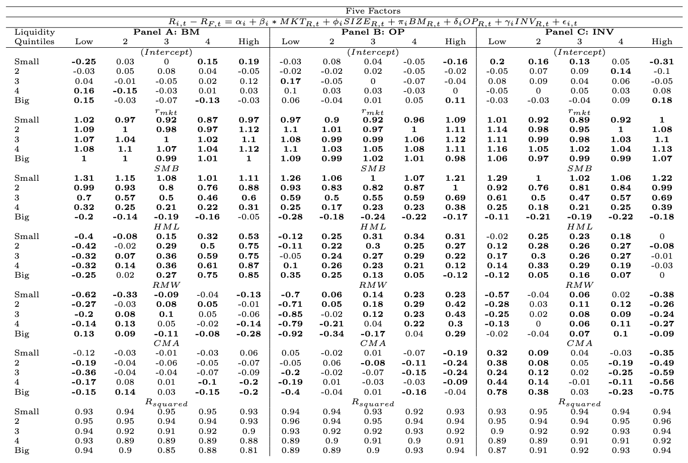

# Fama-French Six-Factor Model Reproduction

This repository contains a reproduction of the Fama-French Six-Factor model, an advanced asset pricing model used in finance. This model extends the traditional Fama-French five-factor model by adding a momentum factor (WML - Winners Minus Losers), which captures the tendency of stocks that have performed well in the past to continue performing well in the future.

## Overview

The Fama-French Six-Factor model includes the following factors:
- **Market Risk Premium (MKT):** The return of the market portfolio minus the risk-free rate.
- **Size (SMB - Small Minus Big):** The return difference between small-cap and large-cap stocks.
- **Value (HML - High Minus Low):** The return difference between stocks with high and low book-to-market ratios.
- **Profitability (RMW - Robust Minus Weak):** The return difference between stocks with robust and weak profitability.
- **Investment (CMA - Conservative Minus Aggressive):** The return difference between firms that invest conservatively and those that invest aggressively.
- **Momentum (WML - Winners Minus Losers):** The return difference between stocks that have performed well in the past and those that have performed poorly.

This repository includes code for:
- Data preparation and processing.
- Construction of the Fama-French Six-Factor model.
- Replication of the empirical tests and results.
- Comparison of the Six-Factor model with other asset pricing models.

## Repository Structure

- `data/`: This folder is not included as it contains data from CRSP & Compustat.
- `mkt_cap/`: Constructing the Size variable from 3 different sources (prioritizing MKVALT > MTHCAP > CSHOQ * PRCCM).
- `./factors`: Contains the main scripts for FF6 model construction and analysis.
- `./factors/tables`: Contains code for generating tables for evaluation.
- `README.md`: This file.

## Installation

This repository is not designed to be run directly after cloning, as the data folder is not present. It's intended as an exhibition of my work. Access to CRSP and Compustat databases is required to download the data. To replicate the results, refer to the original Fama-French papers or contact me for specific details regarding the data items.

With the data folder, the order in which the code should be run is:

1. `be_op_inv.R`
2. `bm_mkt_op_inv.R`
3. `primiss.R`
4. `results_analysis/ff5.R`
5. `results_analysis/ff5_comparison.R`
6. `results_analysis/mom_permno.R`
7. `results_analysis/mom_result_analysis.R`

## Results

The following tables were generated to evaluate the performance of the replicated Fama-French Six-Factor model.

This table below shows the value-weighted returns on 5 by 5 sorts based on Size and Book-to-Market ratios.

This table below shows the distribution stats on the Fama-French factors, including the momentum factor (WML).

This table below shows the regression of 5 by 5 returns (y) on the Six-Factor model (X).

This table below shows the GRS statistics and other performance metrics.

The regression is on size and one of three variables: BM: 1-6, OP: 7-12, INV: 13-18

##

